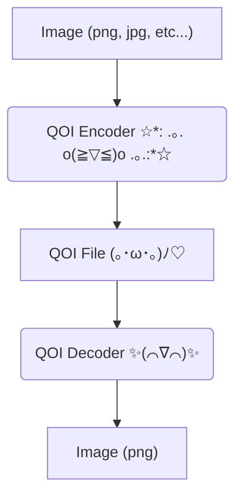

# ✨💖 Qoi-fy Your Images! 💖✨ (uwu edition)

This itsy-bitsy script is like, *totally* magic! It takes your boring old images and makes them all QOI-ified!  (ﾉ◕ヮ◕)ﾉ*:･ﾟ✧  It's super duper fast and efficient, just like a ninja bunny! 🐇💨

## What it does (in a nutshell 🥜)

This code takes an image, encodes it using the *amazing* QOI format, and then decodes it back. Think of it like a secret code for your pictures!  (づ｡◕‿‿◕｡)づ



## How to use it (it's super easy peasy! 🌼)

1.  **Install Pillow:**  You'll need the Pillow library for image magic! Use pip: `pip install Pillow`
2.  **Run the script:**  Just type `python your_script_name.py image.png` in your terminal, replacing `image.png` with the name of your image file.  (⌒‿⌒)
3.  **Ta-da!**: You'll get two new files: `image.qoi` (the encoded QOI file) and `image.png` (the decoded PNG image).  💖💖💖

## Example (because examples are cute! 🐾)

```bash
python qoi_script.py my_cute_kitten.jpg
```

This will create `my_cute_kitten.qoi` and `my_cute_kitten.png`.  (=^･ω･^=)


## Disclaimer (just in case! 🙈)

This code is just for fun and learning! It might not be perfect, but it's made with love and sparkles! ✨💖✨  Please be nice to it!  (๑˃̵ᴗ˂̵)و


That's all folks!  Have fun QOI-fying your images!  (ﾉ´ヮ´)ﾉ*: ･ﾟ
```
